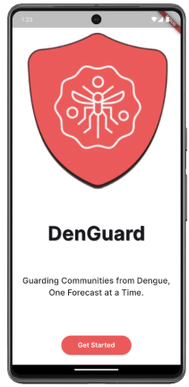
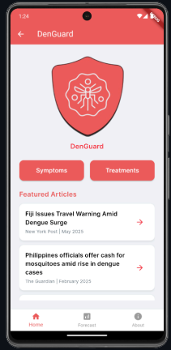
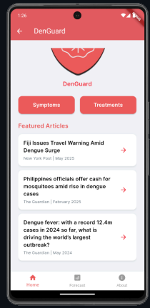
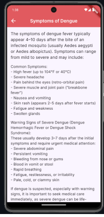
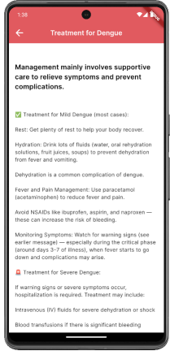
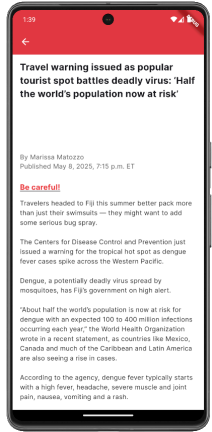
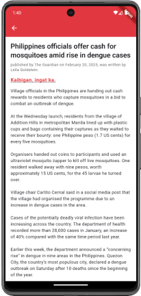
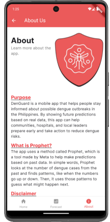
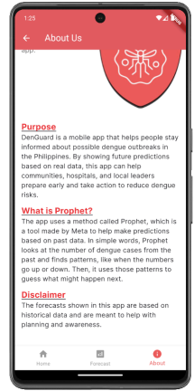
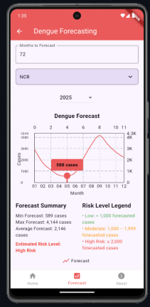

# DenGuard

## Overview
This project aims to predict future dengue cases using Prophet, a time series forecasting procedure developed by Meta. By studying past data from 2016 to 2020, the project will help health officials and communities prepare before outbreaks happen.

The goal is to create a forecasting model that can warn authorities when dengue cases are expected to rise. With this information, they can take preventive actions, such as mosquito control, public awareness campaigns, and preparing hospitals for more patients. By acting early, reducing the number of severe cases and deaths is possible, making a real difference in public health. In the long run, using data-driven solutions like this can help create a healthier and safer future for everyone.

## Screenshots
### Welcome Screen

  

### Home Page

  
  

### Symptoms and Treatment Page
 

### Article Pages
 

### About Us Page
 

### Forecasting Page

## Technology Stack
- **Frontend:** Dart
- **Backend:** Dart, Python
- **Framework:** Flutter
- **Development Tools:** Visual Studio Code, Android Studio
